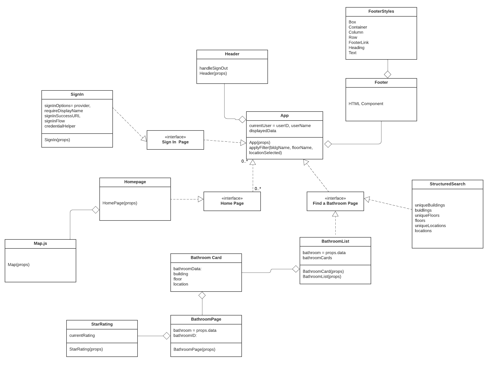
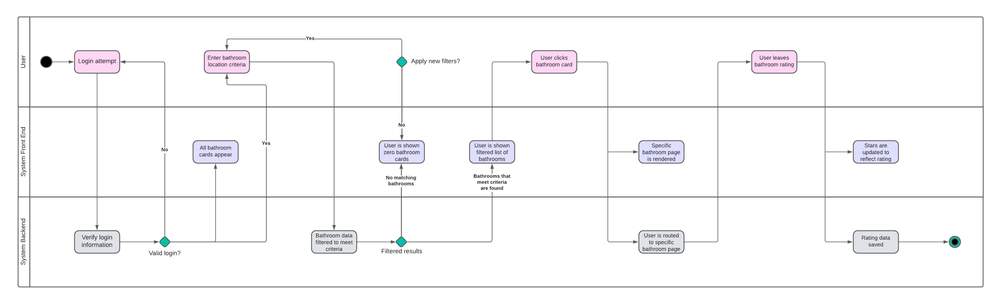
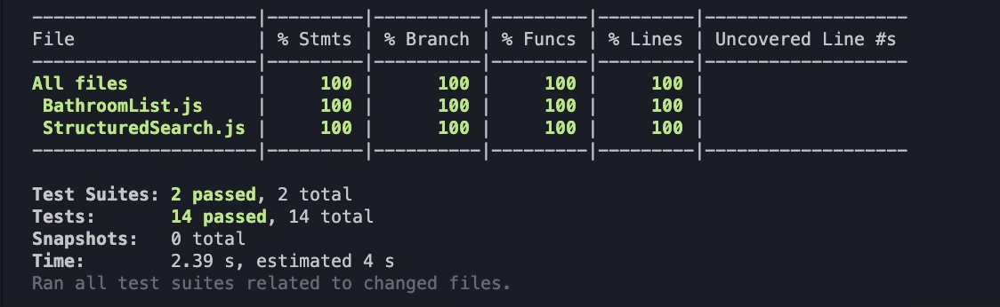

[](https://classroom.github.com/online_ide?assignment_repo_id=10767590&assignment_repo_type=AssignmentRepo)


# Project 1 Final Report Sp'23 <br/> Sydney Castillo and Meghan Munagala
 Sydney Castillo and Meghan Munagala
This codebase consists of files used for the website known as Dub Dumps, created by Sydney Castillo and her teammates Amelia, Nic and Zach, for their final project for INFO 340. The software used for this is a React App.

<br/>

# Code Structure Analysis

## Figure 1: Dub Dumps Class Diagram

The image above is the class diagram for the "Dub Dumps" web app. The interfaces included in the class diagram are listed below:
- **App**: Renders the entire React web app, including how components are routed to.
- **Sign in Page**: Renders the web page where users can log into the web app.
- **Home Page**: Renders the map of bathrooms, as well as navigation to the "Find a Bathroom" page.
- **Find a Bathroom Page**: Renders the list of bathroom cards. Users can filter these cards by building, floor, and location (North, East, South, West Campus).
- **Bathroom Page**: Renders the page for a specific bathroom, which also allows users to rate the bathroom on a scale of 1-5 stars.

This class diagram aids in the understanding of the architecture of the Dub Dumps web app by showing the interfaces, and how they relate to each other. This class diagram is centered around the **App** component, which renders the React web app given its child components. There are several interfaces that inherit from app, including **SignIn** which is where users are able to log into the app using their email or Google account. Additionally, Dub Dumps also has the **HomePage** component, which is where users can view a map of all the bathrooms, as well as navigate to the "Find a Bathroom" page. This page is the **BathroomList** component, which renders the **StructuredSearch** bar, as well as the full list of bathroom cards. By clicking on a single bathroom card, users can navigate to the **BathroomPage** component where they'll be able to give a **StarRating** to a specific bathroom. By including this diagram, viewers of this report will be able to quickly get a sense of how the "Dub Dumps" code is architected.

## Figure 2: Star Rating Activity Diagram

The image above is a sample activity diagram for leaving a star rating on a bathroom in the "Dub Dumps" web app. The process flow is as follows:
1. The user attempts to log into the system via the "Sign in" page.
2. The user's login credential are sent to the system's backend containing user login information. The user checks if the provided information is a valid login.
    1. If no, the user is sent back to the "Sign in" page.
3. If yes, all of the bathroom cards should appear in the "Find a Bathroom" page.
4. The user is now able to enter criteria that the bathroom cards should be filtered by.
5. Once the filters have been applied, the backend logic will determine which cards should appear in the frontend.
6. If the filter returns zero matching bathrooms, the user can choose whether they would like to apply new filters.
7. If the filter does return matching bathrooms, the user is shown this list of cards.
8. The user can then click a specific bathroom card, which will route them to that bathroom's specific page.
9. Here, they can leave a star rating, which will be saved in the user's database of ratings.

The core features of the "Dub Dumps" web app includes searching for a bathroom on campus given a set of filters, as well as rating a single bathroom for one's own reference. The activity diagram depicted above shows the core interactions between a user, the frontend, and the backend for when a user leaves a rating on a bathroom. This diagram is necessary to include in our final report because it allows readers to quickly understand one of the app's core features, thereby inferring what the app as a whole does.

# Architecture Assessment
The architectural element we decided to focus our efforts on was the "Find a Bathroom" page, which is broken up into two components: **StructuredSearch** and **BathroomList**.

## Figure 3: Non-Refactored Structured Search Logic
```
export function StructuredSearch(props) {
    const [bldgSelected, setBldg] = useState('');
    const [floorSelected, setFloor] = useState('');
    const [locationSelected, setLocation] = useState('');

    ...

    // Array of buildings
    let uniqueBuildings = new Set();
    for (let i = 0; i < props.data.length; i++) {
        uniqueBuildings.add(props.data[i].building)
    }
    uniqueBuildings = Array.from(uniqueBuildings);
    const buildings = uniqueBuildings.map((building) => {
        return <option key={building} value={building}>{building}</option>
    })

    // Array of floors
    let uniqueFloors = new Set();
    for (let i = 0; i < props.data.length; i++) {
        uniqueFloors.add(props.data[i].floor)
    }
    uniqueFloors = Array.from(uniqueFloors);

    const floors = uniqueFloors.map((floor) => {
        return <option key={floor} value={floor}>{floor}</option>
    })

    // Array of Locations
    let uniqueLocations = new Set();
    for (let i = 0; i < props.data.length; i++) {
        uniqueLocations.add(props.data[i].location)
    }
    uniqueLocations = Array.from(uniqueLocations);

    const locations = uniqueLocations.map((location) => {
        return <option key={location} value={location}>{location}</option>
    })
}

export default StructuredSearch;
```
The codeblock above is the non-refactored code from the **StructuredSearch** component. This code is the logic that filters the bathroom cards.

- **Code Smells**: At a quick glance, there are two distinct code smells apparent in the code: duplicated code, and unnecessary loops.
    - Duplicated Code: In the codeblock above, it is quickly apparent that the following lines of code are repeated for each filter (building, floor, location) built into the StructuredSearch component. To refactor this, we turned all of the duplicated code into a function that can be called to populate the array of content for each filter.
    ```
    let uniqueBuildings = new Set();
    for (let i = 0; i < props.data.length; i++) {
        uniqueBuildings.add(props.data[i].building)
    }
    uniqueBuildings = Array.from(uniqueBuildings);
    const buildings = uniqueBuildings.map((building) => {
        return <option key={building} value={building}>{building}</option>
    })
    ```
    - Loops: The second, less apparent, code smell we found was an unnecessary loop. In the original code, the `for` loop was being used to loop through `props.data`, adding every unique attribute (building, floor, or location) to the previously defined Set. We later refactored this to completely remove the loop, and instead use native JavaScript functions such as `map()` and `filter()`. The refactored code can be found in the **Refactoring** portion of this report.

- **Documentation and Readability**: Overall, this code does not include enough with information regarding documentation or descriptions on how the code is structured or what the purpose of different sections are. There are a few inline comments that represent the difference between certain sections of code, such as when a user is logged in or logged out.

# Automated Tests

To run the tests for this repository, here are the steps after saving the repository locally:
1. On the command line, navigate to the repository folder.
2. Navigate to the "Dub-Dumps-main" folder.
3. Run "npm install". There may be warning messages that appear but they should not impact the ability to the run the tests.
4. Run "npm test".

Code Coverage we were able to achieve (having issues running the code coverage again):
## Figure X: Automated Test Coverage Report

